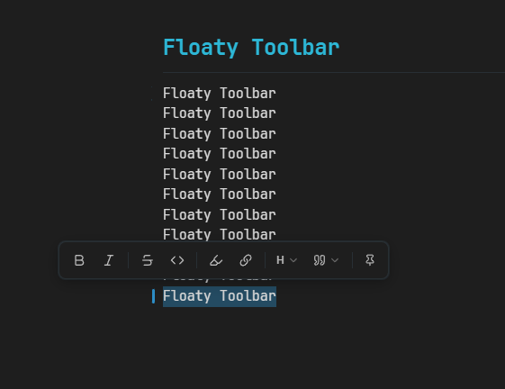
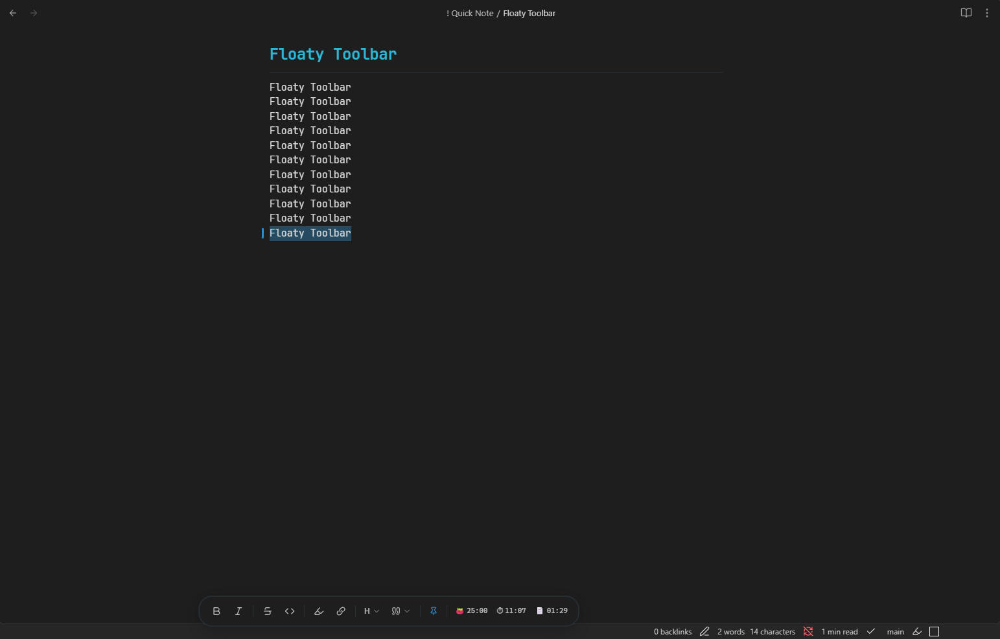

# Floaty Toolbar

A sleek, lightweight floating toolbar for Obsidian that appears whenever you select text. Format your notes instantly without leaving the keyboard or hunting through menus.

---

## Screenshots

### Floating mode

### Dock mode

---

## Features

- **Floating selection toolbar** — pops up above your selection the moment you highlight text
- **Dock mode** — pin the toolbar to the bottom of the screen as a persistent pill
- **Pomodoro HUD** — includes a focus timer in the status bar or dock HUD, depending on the current mode
- **Configurable pomodoro lengths** — set custom work and break minutes in plugin settings
- **Session and file timers** — track total session time and time spent on the current note
- **Custom button order** — drag to reorder toolbar buttons in settings or long-press in the toolbar
- **Smart URL detection** — when inserting a link, optionally use a detected URL from the clipboard
- **Toggle formatting** — clicking a format button a second time removes the formatting
- **Keyboard accessible** — navigate with `Tab` / `Shift+Tab`, activate with `Enter` or `Space`, dismiss with `Escape`
- **Theme compatible** — uses Obsidian CSS variables throughout, works with any community theme

---

## Actions

| Button | Action |
|---|---|
| **B** | Bold (`**text**`) |
| *I* | Italic (`*text*`) |
| ~~S~~ | Strikethrough (`~~text~~`) |
| `<>` | Inline code (`` `text` ``) |
| Highlight | Highlight (`==text==`) |
| Link | Insert link (`[text](url)`) |
| H | Heading (H1–H4, or remove heading) |
| Quote | Callout (Note, Tip, Warning, Important, Caution) |
| Pin | Toggle between floating and dock mode |

---

## Settings

### Pomodoro

Set custom work and break durations in **Settings → Floaty Toolbar**. The same values are used by both the status bar HUD and the dock HUD, so they always stay in sync.

### Dock mode

Pins the toolbar to the bottom centre of the screen. Toggle between modes using the pin icon inside the toolbar — no restart needed.

### Toolbar button order

Reorder toolbar buttons by dragging them in settings. You can also long-press a toolbar button and drag it directly inside the toolbar.

### Smart URL detection

When enabled, the link action can automatically use a URL detected from your clipboard.

---

## Installation

### Community plugins

Submission to the Obsidian community plugin registry is in progress. Once approved:

1. Open Obsidian **Settings → Community plugins**
2. Disable Safe Mode if prompted
3. Click **Browse** and search for `Floaty Toolbar`
4. Click **Install**, then **Enable**

### Manual

1. Download `main.js`, `styles.css`, and `manifest.json` from the [latest release](https://github.com/0png/floaty-toolbar/releases/latest)
2. Copy them into `<vault>/.obsidian/plugins/floaty-toolbar/`
3. Reload Obsidian and enable the plugin in **Settings → Community plugins**

---

## Commands & Hotkeys

All formatting actions are available as Obsidian commands (searchable via `Ctrl/Cmd+P`). Custom hotkeys can be assigned to any of them via **Settings → Hotkeys**.

---

## Screenshot Guide

If you want to update the README screenshots:

1. Put the floating toolbar screenshot at `assets/screenshots/floating-toolbar.png`
2. Put the dock toolbar screenshot at `assets/screenshots/dock-toolbar.png`
3. Commit those files with the README

You can use `.png`, but if you prefer another format, update the image paths in this README to match.

---

## Contributing

Bug reports, feature requests, and pull requests are welcome. Please open an [issue](https://github.com/0png/floaty-toolbar/issues) to discuss significant changes before submitting a PR.

---

## License

MIT

---

Created by [0png](https://github.com/0png)
